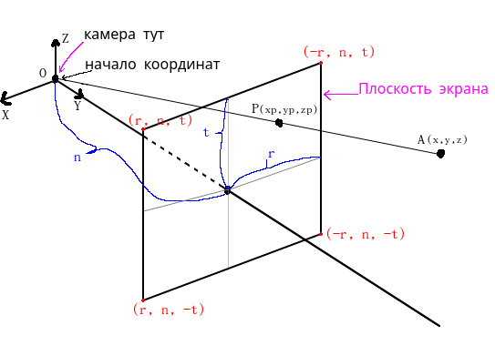
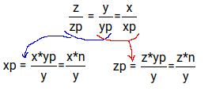
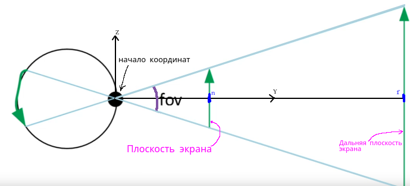
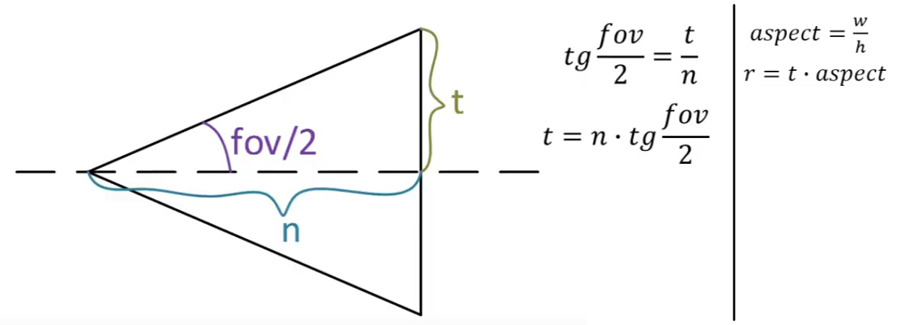
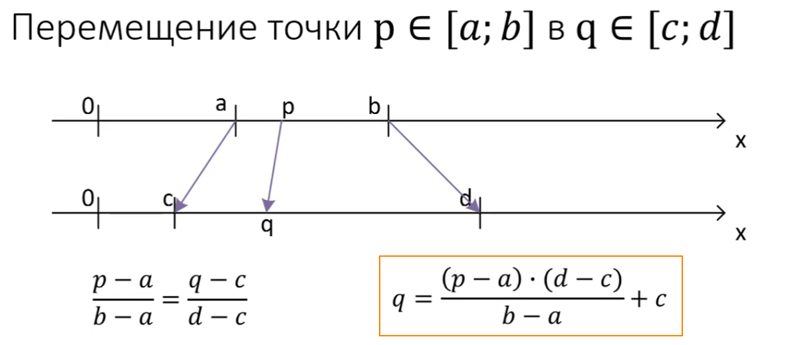
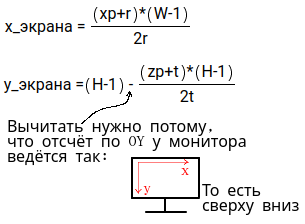
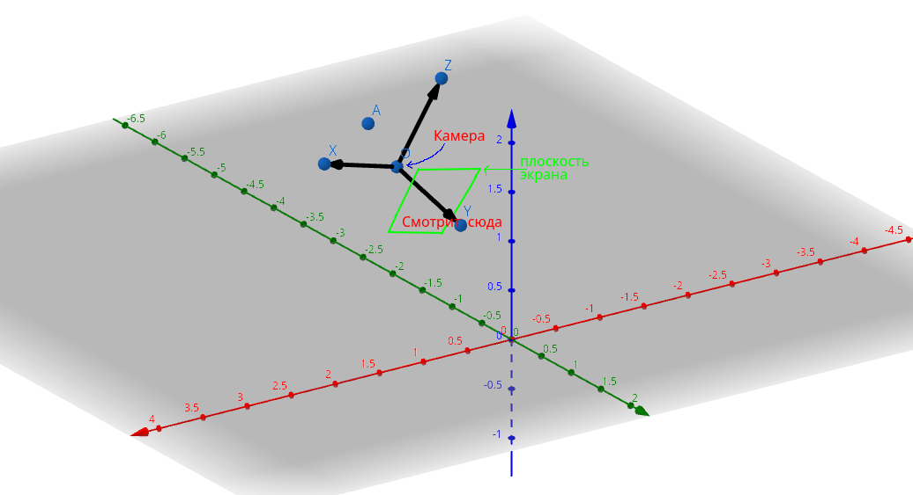
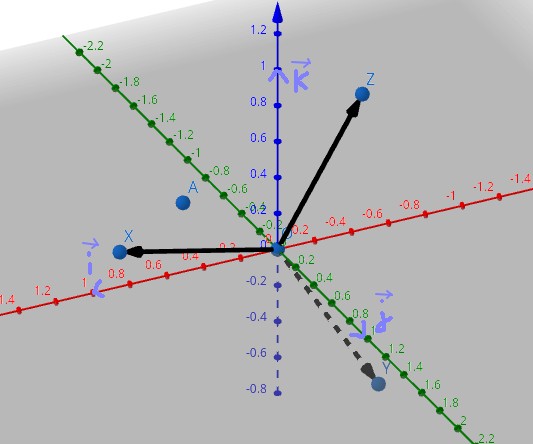
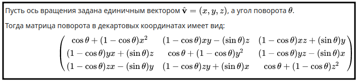
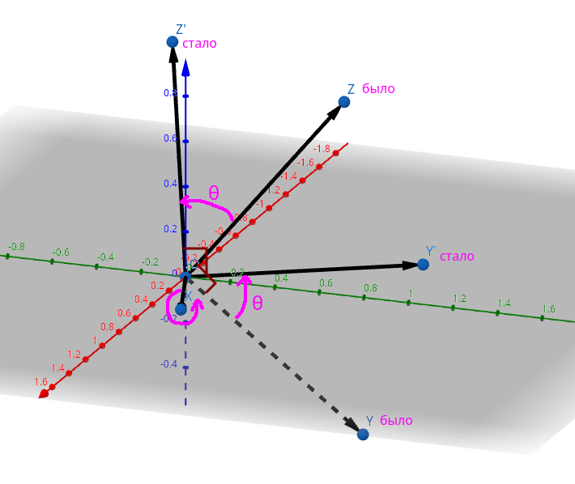

# Что это?

Было необходимо реализовать отрисовку 3d графики, используя лишь одну функцию "разместить пиксель". 

Если задуматься, то это вовсе нетривиальный вопрос. Как визуализировать объект, который имеет 3 координаты, на экране, где есть лишь 2 координаты?

Здесь для отрисовки использовалась лишь одна функция: [`void QPainter::drawPoint(int x, int y)`](https://doc.qt.io/qt-5/qpainter.html#drawPoint-2). То есть нет вызовов функций по типу "нарисовать параллелепипед" или "нарисовать 3d-линию". Только функция "разместить пиксель на экране". И больше ничего, только хардкор!

В репозитории представлен код-шаблон, чтобы можно было бы быстро начать делать проект, где нужно вот так шакально рисовать 3d-графику.

Если интересно, как это сделать, то [здесь](#теория) расписана теория.

# Компиляция

Установите `QT`. Как это сделать, можно посмотреть, например, [тут](https://github.com/The220th/SharedLib/blob/main/cpp/QT/INSTALL.md).

Склонируйте репозиторий:

``` bash
> git clone https://github.com/The220th/template_qwalk
```

Скомпилируйте:

``` bash
> qmake
> make
```

# Использование

После запуска появится экран, где будет тестовая сцена. Перемешаться можно следующим образом:

- Клавиша `Стрелка вперёд` - переместиться вперёд перед собой;

- Клавиша `Стрелка назад` - переместиться назад;

- Клавиша `Стрелка влево` - переместиться влево;

- Клавиша `Стрелка вправо` - переместиться вправо;

- Клавиша `Пробел` - взлететь вверх;

- Клавиша `C` - Опуститься вниз;

- Клавиша `Y` - Переместиться выше относительно "себя";

- Клавиша `I` - Переместиться ниже относительно "себя";

- Клавиша `W` - наклониться вперёд;

- Клавиша `S` - наклониться назад;

- Клавиша `A` - повернуться влево;

- Клавиша `D` - повернуться вправо;

- Клавиша `Q` - наклониться вбок влево;

- Клавиша `E` - наклониться вбок вправо.

Также есть клавиши для "нелокального" перемещения:

- Клавиша `U` - переместиться вперёд по координате OX;

- Клавиша `J` - переместиться назад по координате OX;

- Клавиша `H` - переместиться вперёд по координате OY;

- Клавиша `K` - переместиться назад по координате OY.

~~Почти не лагает...~~

# Изменение параметров

Изменение разрешение экрана: файл `./include/drawField.h` переменные `H` и `W` (ещё можно после этого изменить разрешение в `./main.cpp`). 

Изменение `fov` (поле зрения): файл `./include/drawField.h` переменная `fov`.

Если вам кажется, что объекты расположены не так как хотелось бы, то можете убрать лишние, добавить или переместить их в файле `./tools/planner.cpp`.

# Теория

Всё просто как "дважды два". Но или не совсем как "дважды два"... Но всё равно просто.

Здесь не будут приведены какие-либо доказательства или выводы формул. Будет просто "математическая" инструкция, как отрисовать 3d-объект на экране.

## Перспективная проекция

Пока что представим ситуацию, где "камера" или наблюдатель находится в точности в начале координат и смотрит прямо вдоль оси OY.



Конечно, камера не всегда находится в начале координат и не всегда стоит прямо, а повёрнута. Но обо всём по порядку...

Есть точка `A`, которую мы хотим нарисовать на экране. Если соединить эту точку с началом координат, то прямая пересечёт плоскость экрана в точке `P`. 

Расстояние до плоскости экрана `n`, расстояние до вверха `t` и расстояние до правого края `r` известны. Как найти эти параметры чуть позже.

Так как `OP` и `OA` находятся на одной прямой и коллинеарны, то:



Координата точки `A` (`x`, `y`, `z`) и `yp`=`n` известны, поэтому найти точку пересечение не составит труда.

Останется проверить только, чтобы эта точка не "выходила" за экран. Если не выходит за "экран", то она та, которую нужно отрисовать:

``` cpp
...

if(xp < -r || xp > r) // Если не влезла по ширине
    return; // Точка вне экрана
if(zp < -t || zp > t) // Если не влезла по высоте
    return; // Точка вне экрана
if(y > f || y < n) // f - максимальная дальность
    return; // Точка вне экрана

// Иначе можно рассчитывать дальше
...
```

Можно ввести также ещё один параметр `f`, дальше которого рисоваться точка не будет. А можно полностью игнорировать этот параметр `f`. Просто ведь, очень далёкие объекты превратятся в точку. Тогда их можно и вовсе не рисовать? Это уже на ваше усмотрение.

### Поле зрения fov

Задавать отдельно параметры `t` и `r` можно и вручную, но это достаточно нетривиальная задача. Можно использовать поле зрения. Причём именно вертикальное, а не горизонтальное. Хотя можно и наоборот, но вертикальное удобнее.



За `n` и `f` можно взять "любые" числа. Зависит от задачи. А можно просто за `n` взять `1`, а за `f` взять `1000`, например. В теории, `n=1` или `n=3` не сильно сделает погоду.

Зная `n`, `fov` и разрешение экрана: ширину `W` и высоту `H` - можно высчитать все остальные параметы:



### Трансляция на экран

В итоге получаем такую картину:

- `xp` находится в интервале `[-r, r]`

- `zp` находится в интервале `[-t, t]`

Причём `xp` и `zp` находятся на плоскости экрана. 

Теперь нужно эти координаты "транслировать" в отрезки, связанной с шириной `W` и высотой `H` экрана/окна.

- `xp`: `[-r, r]` -> `[0, W-1]`

- `zp`: `[-t, t]` -> `[0, H-1]`

Для этого есть простая формула:



Тогда:



## Движок не перемещает корабль. Корабль остается на том же месте, а движок перемещает вселенную вокруг него

Как уже говорилось, камера не будет в начале координат. Даже больше, камера будет повёрнута под углом. То есть может быть такая ситуация:



Напомню, что камера "смотрит" вдоль оси OY.

Также можно заметить, что сама камера находится в точке `O`. Пусть координаты точки `O` будут `(xo, yo, zo)`. ~~Хо, ё и зо...~~

Сперва, нужно переместить камеру и её "оси" `OY`, `OZ` и `OX` в начало координат.

Для этого из координаты точек `O`, `X`, `Y`, `Z` (см. рисунок выше) нужно вычесть координаты точки `O`. Также нужно переместить и точку `A`. Из неё тоже вычитаем координаты точки `O`.

- Дано: `X=(x_X, y_X, z_X)`, `Y=(x_Y, y_Y, z_Y)`, `Z=(x_Z, y_Z, z_Z)`, `A=(x_A, y_A, z_A)`

- Вычитаем:

- `x_X = x_X - xo`; `x_Y = x_Y - xo`; `x_Z = x_X - xo`; `x_A = x_A - xo`; 

- `y_X = y_X - y0`; `y_Y = y_Y - y0`; `y_Z = y_X - y0`; `y_A = y_A - y0`; 

- `z_X = z_X - z0`; `z_Y = z_Y - z0`; `z_Z = z_X - z0`; `z_A = z_A - z0`; 

Получится такая ситуация:



Камера и точка `A` "переехали" в начало координат.

Теперь задача свелась вот к какой:

Есть 2 базиса `(i, j, k)` и `(X, Y, Z)`. Векторы басиса `(X, Y, Z)` выражены через базис `(i, j, k)`. Также есть точка `A`, координаты которой даны в базисе `(i, j, k)`. Нужно найти координаты точки `A` в базисе `(X, Y, Z)`.

Эта задача - задача предмета "алгебраические структуры" (или что-то похожее). Задача боян и давно имеет решение. 

Делаем [матрицы](http://mathprofi.ru/deistviya_s_matricami.html) `C` и `v_old`:

``` txt
     x_X  x_Y  x_Y             x_A
C =  y_X  y_Y  y_Y ;  v_old =  y_A
     z_X  z_Y  z_Y             z_A
```

То есть столбцы матрицы `C` - это координаты `X`, `Y` и `Z` соответственно.

Следующим шагом делаем [обратную](http://mathprofi.ru/kak_naiti_obratnuyu_matricu.html) матрицу `C_inv` матрице `C`.

Теперь [умножаем](https://i.imgur.com/xVIzEGv.png) матрицы `C_inv` и `v_old`:

`v_new` = `C_inv` * `v_old`

В матрице `v_new` содержатся точки относительно камеры.

``` txt
         x_new
v_new =  y_new
         z_new
```

Всё, теперь задача свелась к той, [где камера была вначале координат и не повёрнута](#перспективная-проекция). Единственное в чём разница - это то, что теперь у точки `A` координаты `(x_new, y_new, z_new)`, а не `(x, y, z)`.

## Поворот камеры

Ещё одна нетривиальная задача - это поворот камеры.

Есть крутая матрица преобразования:



Не самая приятная формулка, но проще ничего найти не удалось (да и навряд ли существует).

Суть формулы вот в чём. Есть ось вращения. В нашем случае - это `X`, `Y` или `Z`. И теперь любую точку можно повернуть оносительно этой оси вращения. 

Например, хотим мы немного повернуть взгляд головы (камеры) выше. Для этого надо повращать вокруг оси `X`. То есть вместо `(x, y, z)` подставляем `(x_X, y_X, z_X)`. Напомню камера смотрит вдоль OY.



Как видно из примера:

- Во-первых, вращение происходит на угол `θ`.

- Во-вторых, вражение происходит вокруг оси `X` `против часовой стрелки`. Если нужно по часовой, то вращать нужно на угол `-θ` (минус тетта).

- В-третьих, как уже можно было догадаться, если камера находится не в начале координат, то сдвигаем её туда (вычитаем `(xo, yo, zo)`), потом `вращаем`, после это обратно прибавляем `(xo, yo, zo)`.

Здесь был приведён способ, как отобразить 3d-точку на экран. Если это не точка, а прямая, например, то каждую точку этой прямой отображаем на экран. Способ наверняка не самый эффективный способ, но оно работает.