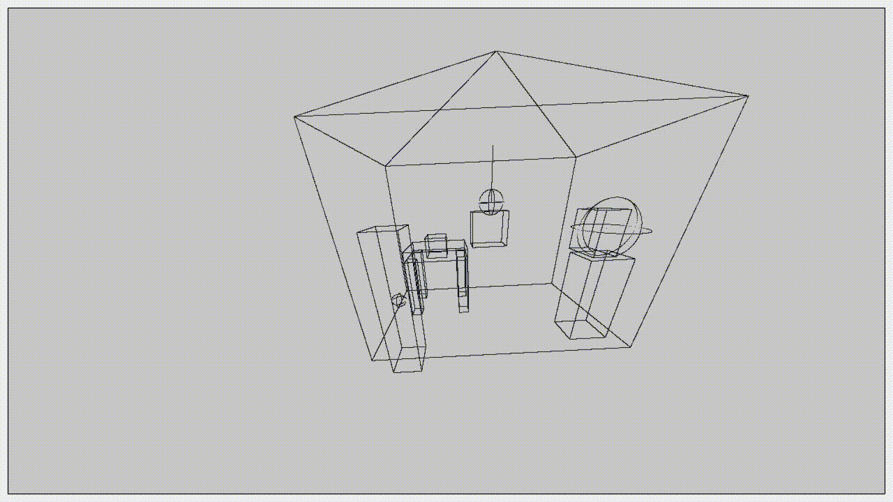

# Что это?

Было необходимо реализовать отрисовку 3d графики, используя лишь одну функцию "разместить пиксель". 

Если задуматься, то это вовсе нетривиальный вопрос. Как визуализировать объект, который имеет 3 координаты, на экране, где есть лишь 2 координаты?

Здесь для отрисовки использовалась лишь одна функция: [`void QPainter::drawPoint(int x, int y)`](https://doc.qt.io/qt-5/qpainter.html#drawPoint-2). То есть нет вызовов функций по типу "нарисовать параллелепипед" или "нарисовать 3d-линию". Только функция "разместить пиксель на экране". И больше ничего, только хардкор!

В репозитории представлен код-шаблон, чтобы можно было бы быстро начать делать проект, где нужно вот так шакально рисовать 3d-графику.

Если интересно, как это сделать, то [здесь](theory.md) расписана теория.

# Компиляция

Установите `QT`. Как это сделать, можно посмотреть, например, [тут](https://github.com/The220th/SharedLib/blob/main/cpp/QT/INSTALL.md).

Склонируйте репозиторий:

``` bash
> git clone https://github.com/The220th/template_qwalk
```

Скомпилируйте:

``` bash
> qmake
> make
```

# Использование



На гифке выше намерено сделано 5 фпс для уменьшения размера гифки.

После запуска появится экран, где будет тестовая сцена. Перемешаться можно следующим образом:

- Клавиша `Стрелка вперёд` - переместиться вперёд перед собой;

- Клавиша `Стрелка назад` - переместиться назад;

- Клавиша `Стрелка влево` - переместиться влево;

- Клавиша `Стрелка вправо` - переместиться вправо;

- Клавиша `Пробел` - взлететь вверх;

- Клавиша `C` - Опуститься вниз;

- Клавиша `Y` - Переместиться выше относительно "себя";

- Клавиша `I` - Переместиться ниже относительно "себя";

- Клавиша `W` - наклониться вперёд;

- Клавиша `S` - наклониться назад;

- Клавиша `A` - повернуться влево;

- Клавиша `D` - повернуться вправо;

- Клавиша `Q` - наклониться вбок влево;

- Клавиша `E` - наклониться вбок вправо.

Также есть клавиши для "нелокального" перемещения:

- Клавиша `U` - переместиться вперёд по координате OX;

- Клавиша `J` - переместиться назад по координате OX;

- Клавиша `H` - переместиться вперёд по координате OY;

- Клавиша `K` - переместиться назад по координате OY.

~~Почти не лагает...~~

# Изменение параметров

Изменение разрешение экрана: файл `./include/drawField.h` переменные `H` и `W` (ещё можно после этого изменить разрешение в `./main.cpp`). 

Изменение `fov` (поле зрения): файл `./include/drawField.h` переменная `fov`.

Если вам кажется, что объекты расположены не так как хотелось бы, то можете убрать лишние, добавить или переместить их в файле `./tools/planner.cpp`.

